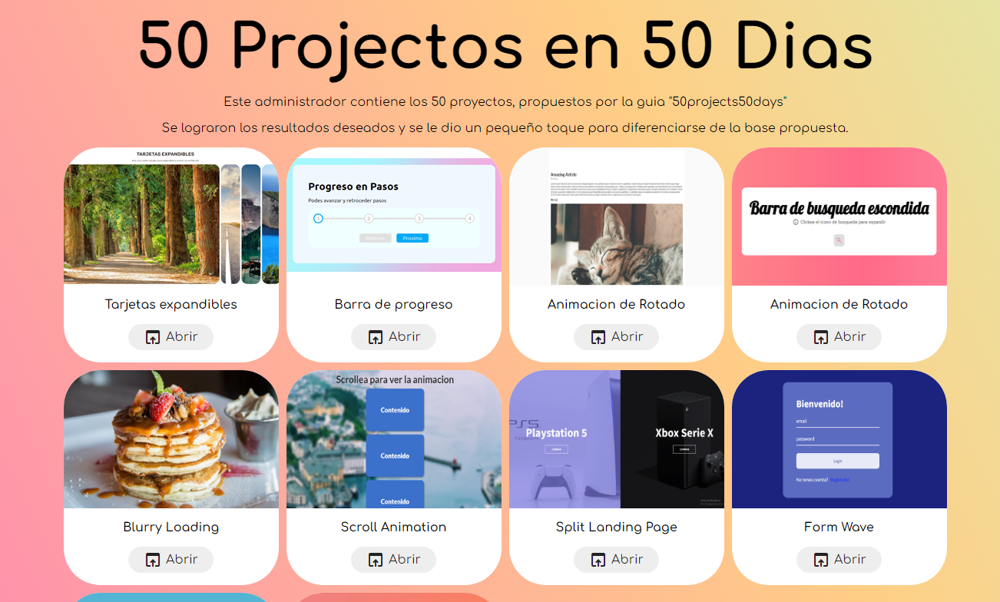

# Reto de 50 proyectos en 50 dias




**50 Projects in 50 Days**
***HTML - CSS - JAVASCRIPT***


## Descripción 📑

Se realiza este proyecto a modo de practica, logrando completar todos los desafios propuestos por [50projects50days](https://github.com/bradtraversy/50projects50days)

Los objetivos a lograr son los siguientes:

 1. Realizar una interfaz para administracion y visualizacion de los mini proyectos
 2. Adjuntar todos los proyectos .
 3. Tomar solo la ayuda visual, sin depender de los codigos.
 4. Intentar mejorar la versión original.
 5. Dar alguna otra pequeña opcion extra o cambio en el diseño.
 6. Recopilar todo lo aprendido en esta guía.

  


### Que aprendí 💡

En esta sección se detallaran, algunas técnicas que se aprendieron a lo largo de la realización del proyecto.

1 - insercion de imagen en etiqueta style

```html
<div  
	class="card active"  
	style="background-image: url('https://cdn.pixabay.com/photo/2017/04/09/09/56/avenue-2215317_960_720.jpg')">
</div>
```

2 - Clase active en html y en css, se escriben diferentes

```html
<div class="card active" ></div>
```
Sin separar el punto y sin :active
```css
.card.active{flex: 5;}
```

3 -  add y remove class from classlist
```js
SELECTOR.classList.add('active');
SELECTOR.classList.remove('active');
```


## Autor 😎

- Linkedin - [in/gabriel-teresczuk](https://www.linkedin.com/in/gabriel-teresczuk/)
